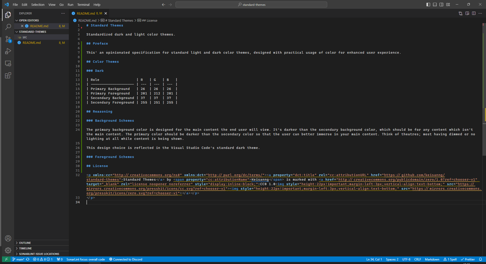

# Standard Themes

Standardized dark and light color themes.

## Preface

This' an opinionated specification for standard light and dark color themes, designed with practical usage of color for enhanced user experience.

## Color Themes

### Dark

| Role                 | R   | G   | B   |
| -------------------- | --- | --- | --- |
| Primary Background   | 26  | 26  | 26  |
| Primary Foreground   | 201 | 212 | 201 |
| Secondary Background | 37  | 37  | 37  |
| Secondary Foreground | 255 | 251 | 255 |

## Reasoning

### Background Schemes

The primary background color is designed for the main content the end user will view. It's darker than the secondary background color, which should be for any content which isn't the main content. The primary color should be darker than the secondary color so that the user can better immerse in your main content. Think of theatres; most having dimmed or no lighting at all while content is being shown.

This design choice is reflected in the Visual Studio Code's standard dark theme:

### Foreground Schemes

## License

<a property="dct:title" rel="cc:attributionURL" href="https://github.com/keisanng/standard-themes">Standard Themes</a> by Keisanng is marked with <a href="http://creativecommons.org/publicdomain/zero/1.0?ref=chooser-v1" target="_blank" rel="license noopener noreferrer" style="display:inline-block;">CC0 1.0</a>

